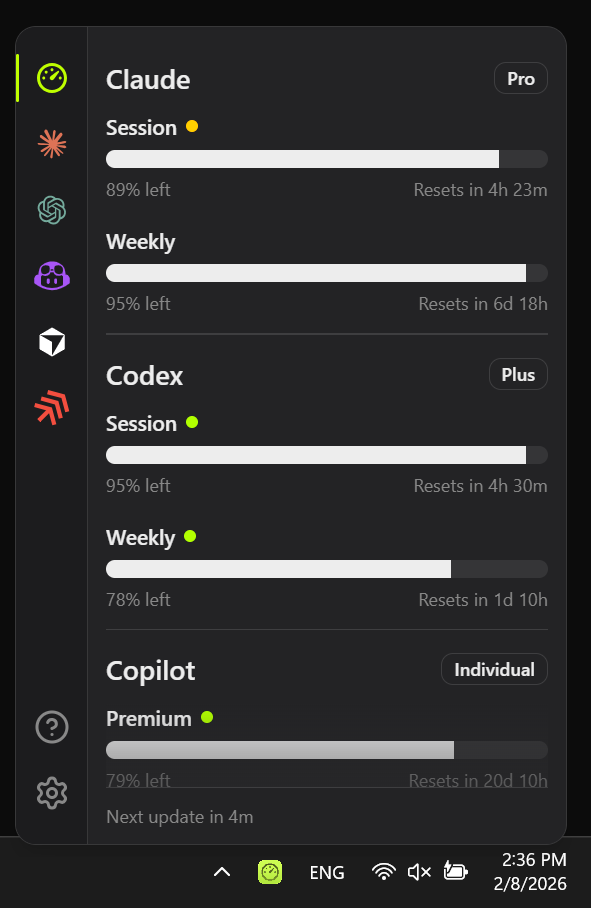

# OpenUsage

**Track all your AI coding subscriptions in one place.**

Amp, Cursor, Claude, Codex, and more coming. See your usage at a glance from your menu bar. No digging through dashboards.



## Download

[**Download the latest release**](https://github.com/robinebers/openusage/releases/latest) (Windows)

The app auto-updates. Install once and you're set.

## What It Does

OpenUsage lives in your menu bar and shows you how much of your AI coding subscriptions you've used. Progress bars, badges, and clear labels. No mental math required.

- **One glance.** All your AI tools, one panel.
- **Always up-to-date.** Refreshes automatically on a schedule you pick.
- **Lightweight.** Opens instantly, stays out of your way.
- **Plugin-based.** New providers get added without updating the whole app.

## Supported Providers

- [**Amp**](docs/providers/amp.md) / free tier, bonus, credits
- [**Antigravity**](docs/providers/antigravity.md) / all models
- [**Claude**](docs/providers/claude.md) / session, weekly, extra usage
- [**Codex**](docs/providers/codex.md) / session, weekly, reviews, credits
- [**Copilot**](docs/providers/copilot.md) / premium, chat, completions
- [**Cursor**](docs/providers/cursor.md) / credits, plan usage, on-demand
- [**Gemini**](docs/providers/gemini.md) / pro, flash, workspace/free/paid tier
- [**Kimi Code**](docs/providers/kimi.md) / session, weekly
- [**Windsurf**](docs/providers/windsurf.md) / prompt credits, flex credits

### Maybe Soon

- [Factory / Droid](https://github.com/robinebers/openusage/issues/16)
- [Vercel AI Gateway](https://github.com/robinebers/openusage/issues/18)

Community contributions welcome.
Want a provider that's not listed? [Open an issue.](https://github.com/robinebers/openusage/issues/new)

## Open Source, Community Driven

OpenUsage is built by its users. Hundreds of people use it daily, and the project grows through community contributions: new providers, bug fixes, and ideas.

I maintain the project as a guide and quality gatekeeper, but this is your app as much as mine. If something is missing or broken, the best way to get it fixed is to contribute by opening an issue, or submitting a PR.

Plugins are currently bundled as we build our the API, but soon will be made flexible so you can build and load their own.

**Linux:** on the roadmap. If you can help test, [open an issue](https://github.com/robinebers/openusage/issues/new).

### How to Contribute

- **Add a provider.** Each one is just a plugin. See the [Plugin API](docs/plugins/api.md).
- **Fix a bug.** PRs welcome. Provide before/after screenshots.
- **Request a feature.** [Open an issue](https://github.com/robinebers/openusage/issues/new) and make your case.

Keep it simple. No feature creep, no AI-generated commit messages, test your changes.

## Built Entirely with AI

Not a single line of code in this project was read or written by hand. 100% AI-generated, AI-reviewed, AI-shipped — using [Cursor](https://cursor.com), [Claude Code](https://docs.anthropic.com/en/docs/claude-code), and [Codex CLI](https://github.com/openai/codex).

OpenUsage is a real-world example of what I teach in the [AI Builder's Blueprint](https://itsbyrob.in/EBDqgJ6
) — a proven process for building and shipping software with AI, no coding background required.

## Sponsors

OpenUsage is supported by our sponsors. Become a sponsor to get your logo here and on [openusage.ai](https://openusage.ai).

[Become a Sponsor](https://github.com/sponsors/robinebers)

<!-- Add sponsor logos here -->

## Credits

Inspired by [CodexBar](https://github.com/steipete/CodexBar) by [@steipete](https://github.com/steipete). Same idea, very different approach.

## License

[MIT](LICENSE)

---

<details>
<summary><strong>Build from source</strong></summary>

### Stack

- Tauri 2 + Rust
- React 19, Tailwind 4, Base UI
- Vite 7, bun

### Prerequisites

- [Rust](https://rustup.rs/) (stable)
- [bun](https://bun.sh/) (or npm/pnpm)
- **macOS:** Xcode Command Line Tools (`xcode-select --install`)
- **Windows:** [Visual Studio Build Tools](https://visualstudio.microsoft.com/visual-cpp-build-tools/) with "Desktop development with C++" workload, plus [WebView2](https://developer.microsoft.com/en-us/microsoft-edge/webview2/) (pre-installed on Windows 10 21H2+ and Windows 11)

### Build

```bash
git clone https://github.com/robinebers/openusage
cd openusage
bun install
bun tauri build
```

Windows outputs:

- `src-tauri/target/release/openusage.exe`
- `src-tauri/target/release/bundle/msi/`
- `src-tauri/target/release/bundle/nsis/`

### Development

```bash
bun install
bun tauri dev
```

This compiles the Rust backend and starts the frontend dev server with hot-reload.

### Clean build artifacts (free disk space)

If your repo grows very large (for example ~13GB), remove generated artifacts:

```powershell
# Windows (PowerShell)
Remove-Item -Recurse -Force dist,node_modules,src-tauri/target,src-tauri/resources/bundled_plugins
```

```bash
# macOS/Linux
rm -rf dist node_modules src-tauri/target src-tauri/resources/bundled_plugins
```

Recreate dependencies/build outputs when needed:

```bash
bun install
bun run bundle:plugins
```

### Release (Windows only, GitHub Actions)

This repo publishes Windows release artifacts via `.github/workflows/publish.yml`.

1. Ensure versions match in:
   - `package.json`
   - `src-tauri/Cargo.toml`
   - `src-tauri/tauri.conf.json`
2. Create and push a tag:

```bash
git tag v0.5.2
git push origin v0.5.2
```

3. GitHub Actions builds and publishes Windows installers to the matching GitHub Release.
   It also uploads a portable ZIP: `OpenUsage-vX.Y.Z-windows-x64-portable.zip` (extract and run `openusage.exe`).

Manual trigger is also supported via **Actions > Publish** with a `vX.Y.Z` tag input.

</details>
